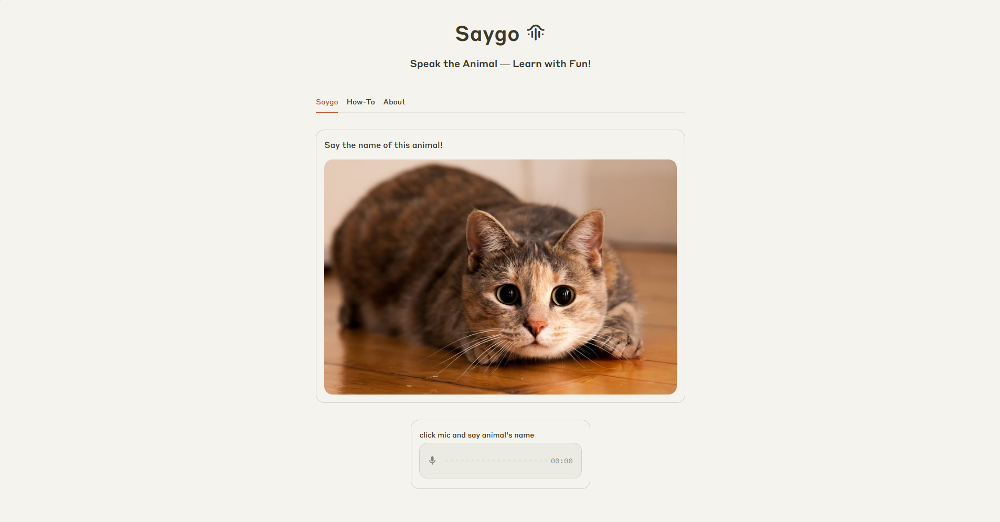

# Saygo 🐾

Saygo adalah aplikasi belajar interaktif yang membantu anak-anak berlatih berbicara dan mengenali nama hewan menggunakan model Faster-Whisper yang dijalankan secara lokal. Aplikasi ini dilengkapi dengan antarmuka berbasis Streamlit agar mudah digunakan secara langsung melalui browser.

## 🔍 Fitur

- Permainan tebak nama hewan dengan input suara  
- Pengenalan suara lokal menggunakan Faster-Whisper  
- Umpan balik langsung untuk jawaban benar atau salah  
- Antarmuka web sederhana dengan Streamlit  

## 🧠 Teknologi yang Digunakan

- Faster-Whisper (Local Speech Recognition)  
- Streamlit (UI)  
- Python  

## 🚀 Coba Aplikasi

> **Note:** Karena aplikasi dihosting menggunakan Streamlit Community Cloud (free tier), aplikasi bisa dalam kondisi sleep. Jika muncul tombol “Yes, get this app back up!”, klik tombol tersebut untuk membangunkan aplikasi.

🌐 [Link Demo Aplikasi](https://letsaygo.streamlit.app/)
